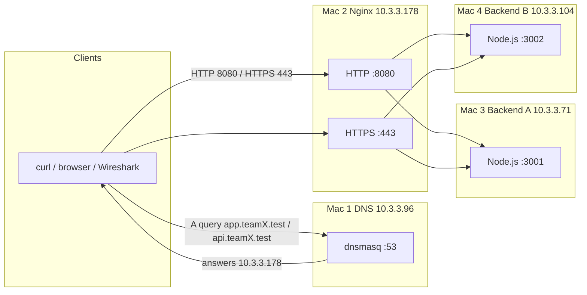

# CN Private Network Platform

Computer Networks Project — Phase 1

Infrastructure type 1: four physical macOS laptops on a shared private Wi-Fi/LAN.

Repository: https://github.com/Lucifer-Saksham/CN-Private-Network-Platform

## 1. Project title

CN Private Network Platform

## 2. Project overview

This project builds a small private service platform on four Macs. A dedicated DNS host (dnsmasq) answers two application names. Those names point at an Nginx edge that terminates HTTP and HTTPS and forwards each request to one of two independent Node.js REST backends using default round-robin load balancing. Clients and packet captures are used to show DNS, TCP, TLS, HTTP headers, and the path through the proxy.

Private names in use:

- `app.teamX.test` → `10.3.3.178`
- `api.teamX.test` → `10.3.3.178`

## 3. Objectives

The assignment demonstrates:

- IPv4 addressing and LAN reachability
- Application-layer DNS (A records via dnsmasq)
- HTTP as a REST transport
- Reverse proxying and round-robin upstream selection
- TLS 1.2 / TLS 1.3 with a self-signed certificate and SAN names
- Cache-Control freshness and optional ETag / 304 conditional GET
- Packet analysis of DNS, TCP handshake, and TLS records in Wireshark

## 4. Team

| Machine | Member | Responsibility | IPv4 |
| --- | --- | --- | --- |
| Mac 1 | Saksham Miglani | Private DNS (dnsmasq) and client testing | 10.3.3.96 |
| Mac 2 | Kavya Mukhija | Nginx reverse proxy, load balancing, HTTPS | 10.3.3.178 |
| Mac 3 | Shubham | Backend A (Node.js, port 3001) | 10.3.3.71 |
| Mac 4 | Divyanshi | Backend B (Node.js, port 3002) | 10.3.3.104 |

## 5. Architecture



DNS records: both `app.teamX.test` and `api.teamX.test` map to Nginx. Nginx does not host application logic; it proxies to A then B, then A then B, unless an upstream is down.

## 6. IP addressing table

Subnet mask `255.255.252.0` (`/22`), gateway `10.3.0.1`, interface `en0`.

MAC addresses below are **recorded `en0` addresses at the time of inventory**. They are not treated as permanent burned-in hardware identifiers; macOS often uses randomized private Wi-Fi addresses.

| Machine | Member | Role | IPv4 | Subnet mask | Gateway | Interface | Recorded en0 MAC |
| --- | --- | --- | --- | --- | --- | --- | --- |
| Mac 1 | Saksham Miglani | DNS | 10.3.3.96 | 255.255.252.0 | 10.3.0.1 | en0 | 42:00:5a:55:c0:03 |
| Mac 2 | Kavya Mukhija | Nginx / HTTPS | 10.3.3.178 | 255.255.252.0 | 10.3.0.1 | en0 | 2a:dd:26:44:5e:28 |
| Mac 3 | Shubham | Backend A | 10.3.3.71 | 255.255.252.0 | 10.3.0.1 | en0 | fa:b0:b9:81:2f:96 |
| Mac 4 | Divyanshi | Backend B | 10.3.3.104 | 255.255.252.0 | 10.3.0.1 | en0 | b6:ef:cf:b0:f9:28 |

The Wireshark file `evidence/wireshark/tls-handshake.pcapng` shows ARP for `10.3.3.178` using `2a:dd:26:44:5e:28`, which matches the Mac 2 inventory address.

## 7. Technology stack

- macOS
- Node.js (standard library `http` and `crypto` only)
- dnsmasq
- Nginx
- OpenSSL
- Wireshark
- Git / GitHub
- HTTP / HTTPS
- TCP/IP
- curl
- dig

## 8. Features

- Four-host private LAN with fixed inventory addresses
- dnsmasq A records for `app.teamX.test` and `api.teamX.test`
- Backend A JSON API on `0.0.0.0:3001` with `X-Backend: A`
- Backend B JSON API on `0.0.0.0:3002` with `X-Backend: B`
- `Cache-Control: public, max-age=30` on successful API responses
- ETag and HTTP 304 for matching `If-None-Match` (implemented in repo; live 304 evidence still pending)
- Nginx HTTP listener on port 8080
- Nginx HTTPS listener on port 443 with TLS 1.2 and TLS 1.3
- Default round-robin upstream to A and B
- Self-signed RSA 2048 certificate with SANs (generation script in `tls/`)
- Helper scripts that report PASS, FAIL, or BLOCKED / MACHINE UNAVAILABLE
- Packet capture of a TCP three-way handshake to port 443 (see Evidence)

## 9. Directory structure

```
CN-Private-Network-Platform/
  README.md
  .gitignore
  backend-a/          server.js, package.json (Mac 3, :3001)
  backend-b/          server.js, package.json (Mac 4, :3002)
  dns/                dnsmasq.conf
  nginx/              nginx.conf, nginx.conf.template
  tls/                openssl.cnf, generate-self-signed.sh, certs/
  scripts/            check-lan, test-*, validate-project
  docs/               architecture, audit, demo, caching, checklist
  evidence/           lan, dns, backend, nginx, tls, tcp, caching,
                      load-balancing, wireshark, demo
```

## 10. Setup instructions

Clone the repository on every Mac. Do not commit private keys. Do not point a laptop at Mac 1 for DNS unless you accept that internet name resolution may break if dnsmasq stops.

### Mac 1 — DNS (Saksham)

1. Install dnsmasq (Homebrew: `brew install dnsmasq`).
2. Copy `dns/dnsmasq.conf` to the conf path Homebrew prints (`/opt/homebrew/etc/dnsmasq.conf` or `/usr/local/etc/dnsmasq.conf`).
3. Check syntax: `dnsmasq --test`.
4. Start the service with the method Homebrew documents (`sudo brew services start dnsmasq` is common). Port 53 usually needs administrator rights.
5. Test **without** changing Wi-Fi DNS: `dig @10.3.3.96 app.teamX.test +short` should print `10.3.3.178`.
6. Only if the demo requires system-wide names, set Wi-Fi DNS to `10.3.3.96` manually. Restore the previous DNS servers afterwards.

### Mac 2 — Nginx (Kavya)

1. Install Nginx and OpenSSL.
2. Place `tls/certs/server.crt` and `tls/certs/server.key` on this Mac. Generate them with `tls/generate-self-signed.sh` if they do not exist yet.
3. `nginx/nginx.conf` uses `/Users/kavyamukhija/Desktop/CN-Private-Network-Platform/tls/certs/`. If the clone is not at that path, copy `nginx/nginx.conf.template`, replace `REPO_ROOT`, and keep the running service in sync with the file you actually load.
4. Validate: `nginx -t -c /absolute/path/to/nginx/nginx.conf`
5. Start Nginx. Binding to 443 typically requires `sudo`.
6. Confirm backends are listening before expecting 200s.

### Mac 3 — Backend A (Shubham)

```bash
cd backend-a
node server.js
```

Listens on `0.0.0.0:3001`. Keep the lid open / disable sleep during the demo.

### Mac 4 — Backend B (Divyanshi)

```bash
cd backend-b
node server.js
```

Listens on `0.0.0.0:3002` (not 3001).

## 11. Startup order

1. Confirm all four addresses ping (`scripts/check-lan.sh`).
2. Start dnsmasq on Mac 1.
3. Start Backend A on Mac 3.
4. Start Backend B on Mac 4.
5. Start Nginx on Mac 2.
6. Validate from a client (`scripts/validate-project.sh`).

## 12. Testing commands

Direct DNS (does not depend on Wi-Fi DNS settings):

```bash
dig @10.3.3.96 app.teamX.test +short
dig @10.3.3.96 api.teamX.test +short
```

Backends:

```bash
curl -sS -D - http://10.3.3.71:3001/api/status
curl -sS -D - http://10.3.3.104:3002/api/status
```

HTTP proxy:

```bash
curl -sS -D - http://10.3.3.178:8080/api/status
```

HTTPS with verification (no `-k`):

```bash
curl -sS -D - --cacert tls/certs/server.crt \
  --resolve app.teamX.test:443:10.3.3.178 \
  https://app.teamX.test/api/status
```

Load balancing:

```bash
bash scripts/test-load-balancing.sh
```

Headers to record: `X-Backend`, `Cache-Control`, `ETag`.

**This documentation pass (Mac 1 on the LAN):** `dig @10.3.3.96` for both names returned `10.3.3.178`. Macs 2–4 did not answer ping, so HTTP/HTTPS/backends were BLOCKED. Save a `dig` screenshot into `evidence/dns/` even though the command already succeeded.

## 13. TLS explanation

A typical handshake:

1. **ClientHello** — client offers TLS versions and cipher suites (and SNI `app.teamX.test`).
2. **ServerHello** — server selects TLS 1.2 or 1.3 and a cipher.
3. **Certificate** — server presents the self-signed cert. In **TLS 1.2** this is often visible in Wireshark. In **TLS 1.3** the Certificate message is encrypted, so a passive capture may **not** show the PEM/SAN fields.
4. **Certificate validation** — curl uses `--cacert` (or a trust store you installed). The subject must match the name in the URL; SANs must include `app.teamX.test` and `api.teamX.test`.
5. **Key establishment** — TLS 1.2 key exchange or TLS 1.3 handshake keys; not something we log.
6. **Application data** — HTTP is encrypted from this point.

`curl -k` disables validation and is **not** acceptable as final proof. This repository does not claim that the certificate is in the macOS System keychain unless you install it yourself and re-test.

## 14. Caching explanation

Successful backend responses send `Cache-Control: public, max-age=30`. That means a cache **may** reuse the response for 30 seconds. It is **not** the same as proving a cache HIT.

The Node servers also send an `ETag`. A client that repeats the request with `If-None-Match: <etag>` should receive **304 Not Modified** and an empty body. That behaviour is implemented and checked by `scripts/test-local-backends.sh`. A live LAN 304 screenshot is still pending. Nginx is **not** configured as a content cache; it forwards to backends.

## 15. Wireshark analysis

File present in the repository: [evidence/wireshark/tls-handshake.pcapng](evidence/wireshark/tls-handshake.pcapng)

What that capture actually contains (read with `tcpdump -nn -r`):

- ARP for `10.3.3.178` (`2a:dd:26:44:5e:28`)
- TCP **SYN** from `10.3.3.96:52396` to `10.3.3.178:443`
- TCP **SYN-ACK** back
- TCP **ACK** (three-way handshake complete)
- Subsequent TCP segments with payload (TLS records). The capture does **not** prove a visible certificate in Wireshark; treat certificate visibility as TLS-version dependent.
- Later UDP/53 queries from Mac 2 to Mac 1 for **public** names (`www.google.com`, WhatsApp hosts). That shows Mac 1 answering DNS on port 53, but it is **not** an `app.teamX.test` query/answer pair.

Still needed: a filtered capture of `dig @10.3.3.96 app.teamX.test` showing the question and the A record `10.3.3.178`.

Sequence numbers, ACKs, and retransmission behaviour can be shown from the TCP conversation above (ports 52396 → 443).

## 16. Limitations

- Certificate is self-signed; browsers will warn unless the tester uses `--cacert` or a manually trusted CA.
- Scope is a private LAN, not the public internet.
- System DNS on clients is fragile if Wi-Fi DNS is pointed at Mac 1; prefer `dig @10.3.3.96`.
- All four laptops must stay awake and on the same `/22`.
- A cache HIT from a shared HTTP cache is **not** claimed.
- Live 304 evidence on the LAN is **not** in the repository yet.
- Demo video is not uploaded yet.
- IPs can change if the hotspot DHCP lease changes; update `docs/ip-table.md` only after a verified `ifconfig en0`.

## 17. Evidence

Do not invent extra screenshot names. Files that currently exist:

| Item | Path |
| --- | --- |
| TLS/TCP capture | [evidence/wireshark/tls-handshake.pcapng](evidence/wireshark/tls-handshake.pcapng) |
| What to capture next | [evidence/README.md](evidence/README.md) |
| Presence vs pending | [evidence/MANIFEST.md](evidence/MANIFEST.md) |

## 18. Demo video

Demo video pending upload.

Expected file name:

`CN_Phase1_CN-Private-Network-Platform_TeamSaksham_Type1.mp4`

Constraints: MP4, 1080p recommended, about 5 minutes, maximum 500 MB. Upload to Google Drive, share as “anyone with the link — viewer”, and test the link in a private/incognito window. Put the URL in this section after that check. Do not paste a placeholder URL.

Recording script: [docs/DEMO_SCRIPT.md](docs/DEMO_SCRIPT.md)

## 19. Final status

**Not submission-complete.** Repository code, configuration templates, and documentation for Phase 1 are in place. Mandatory **live evidence** (screenshots of ping, dig, both backends, HTTP, HTTPS `--cacert`, load-balancing sequence, Cache-Control, optional 304, DNS pcap, demo video) is still incomplete. See [docs/PROJECT_AUDIT.md](docs/PROJECT_AUDIT.md) and [docs/SUBMISSION_CHECKLIST.md](docs/SUBMISSION_CHECKLIST.md).

Historical lab results listed in the audit are prior measurements, not a substitute for files in `evidence/`.
