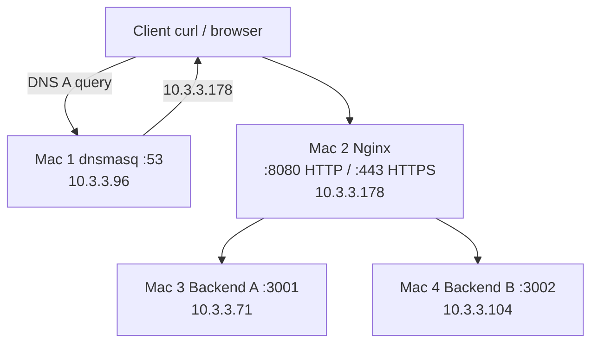

# Architecture

Request path:

1. Client asks Mac 1 (`10.3.3.96`) for `app.teamX.test` or `api.teamX.test`.
2. dnsmasq returns `10.3.3.178` (Mac 2).
3. Client connects to Nginx on TCP 8080 (HTTP) or 443 (HTTPS).
4. Nginx selects Backend A (`10.3.3.71:3001`) or Backend B (`10.3.3.104:3002`) using default round-robin.
5. The chosen Node process returns JSON and headers; Nginx forwards them.

Certificate files live on Mac 2. The copy of `nginx/nginx.conf` in Git uses:

`/Users/kavyamukhija/Desktop/CN-Private-Network-Platform/tls/certs/`

If that path is wrong on the live host, HTTPS will fail until the `ssl_certificate` lines are updated. Use `nginx/nginx.conf.template` when cloning elsewhere.
