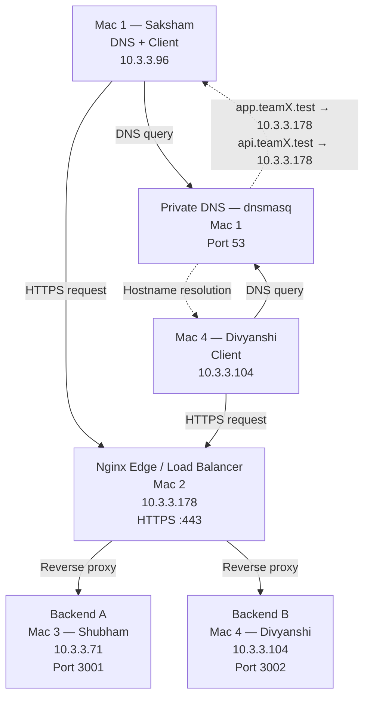

# Phase 1 — Network Architecture

## 1. Overview

The Private Network Service Platform consists of four macOS laptops connected to the same private Wi-Fi/LAN.

The system uses:
- dnsmasq for private DNS resolution
- Nginx as the HTTPS reverse proxy and load balancer
- Two REST backend services
- TLS encryption for client-to-proxy communication
- Wireshark for network traffic analysis

## 2. Network Topology

## 3. Request Flow

1. A client requests `app.teamX.test`.
2. The client queries the private DNS server running on Mac 1.
3. dnsmasq resolves the hostname to the private IP of Mac 2.
4. The client establishes an HTTPS connection with Nginx.
5. Nginx terminates TLS and forwards the request to a backend.
6. Backend A or Backend B processes the request.
7. The response travels back through Nginx to the client.

## 4. Service Allocation

| Component | Device | Private IP | Service |
|---|---|---|---|
| Private DNS | Mac 1 | 10.3.3.96 | dnsmasq |
| Reverse Proxy / Load Balancer | Mac 2 | 10.3.3.178 | Nginx |
| Backend A | Mac 3 | 10.3.3.71 | REST API :3001 |
| Backend B | Mac 4 | 10.3.3.104 | REST API :3002 |

## 5. Security and Networking

- DNS is private to the project network.
- HTTPS protects client-to-Nginx communication.
- Nginx acts as the single public-facing application entry point within the private LAN.
- Backend services are accessed through Nginx during the demonstration.
- Wireshark will be used to inspect DNS, TCP, TLS, and HTTP-related traffic.

## 6. Current Scope

This document describes Phase 1 only.
